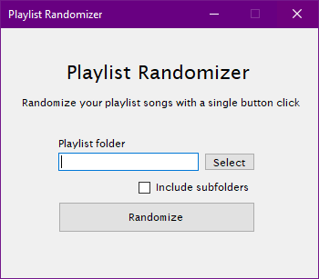
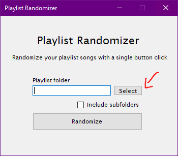
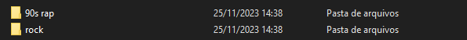
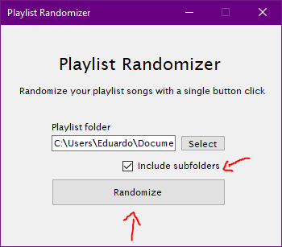

# 🎵🔀 Playlist Randomizer

An desktop app that randomize playlists for better using in more simple car radios.

Normally, these kind of radios have random option, but they can play a music from another playlist folder.



### How to use

| Title               |                          Image                          | Description                                                                                                                |
| :------------------ | :-----------------------------------------------------: | -------------------------------------------------------------------------------------------------------------------------- |
| Step 1              |           | Select the playlist folder                                                                                                 |
| Example of playlist |  | This playlist contains their songs in subfolders, so it will have to be specified                                          |
| Step 2              |    | After selecting the folder, you can mark the option include subfolders, if needed, and then click in the randomize button. |

## ✨ How to contribute

First of all, you'll need to clone this repository and create a new branch from the main.

```bash
git clone https://github.com/https-eduardo/playlist-randomizer.git

git checkout -b your_branch_name
```

After cloning the repository, you can start implementing your features, fixing the code or refactoring.
When your changes are finished, open a pull request to be reviewed and, then, merged.
